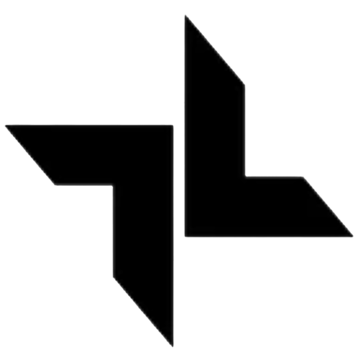
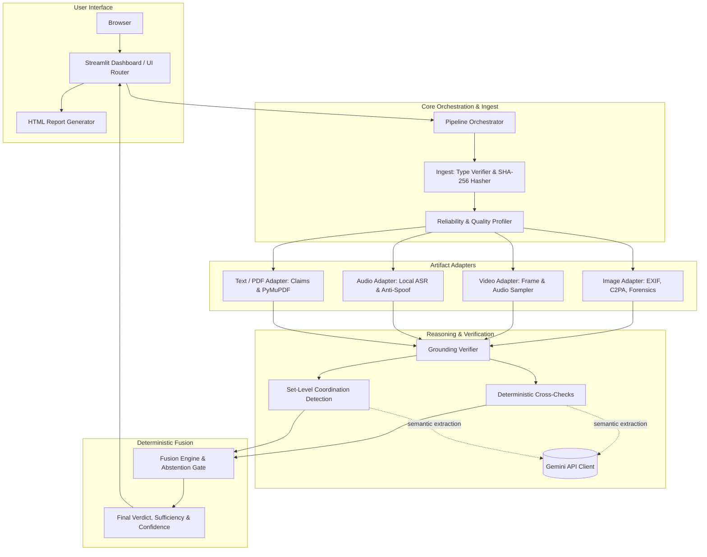
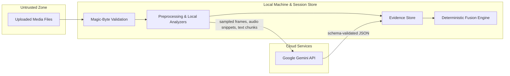

# TrustLayers

<p align="center">
  
</p>

<p align="center">
  <strong>Multimodal Digital Authenticity Investigation Tool</strong><br>
  Cross-artifact evidence gathering, deterministic fusion, and grounded provenance analysis.
</p>

---

## Overview

**TrustLayers** is an open multimodal investigation tool designed for journalists, researchers, and integrity analysts to evaluate the authenticity of digital media. 

Traditional detection tools attempt to answer *"is this single file fake?"* with a single probability score. In real-world disinformation and fraud, this approach routinely breaks down:
- Isolated classifiers produce high false-positive rates on compressed or poor-quality genuine media.
- Realistic generative models bypass simple statistical pattern checks.
- Real, authentic media is frequently repurposed in false contexts ("cheapfakes" and misattribution), which pixel-level detectors cannot detect.

TrustLayers approaches verification as a **holistic investigation across multiple related artifacts**. Users submit a case containing any combination of images, video, audio, text, and PDF documents. The system analyzes each artifact individually, evaluates cross-modal corroboration and contradictions, detects coordinated synthetic patterns, and computes an explainable verdict with grounded evidence and explicit limitations.

---

## Key Capabilities

- **Multimodal Case Ingestion**: Ingest and analyze heterogeneous sets of media (images, video clips, recorded audio, transcripts, and PDF documents) in a single investigation session.
- **Deterministic Fusion Engine**: Final verdicts are computed through strict rule-based logic—never delegated to an unconstrained language model.
- **Grounded Evidence**: Every finding must point to an explicit, verifiable reference (video frame and bounding region, audio timestamp, extracted text snippet, or PDF page). Hallucinated or floating claims are rejected.
- **Dual-Axis Evidence Accounting**: Keeps manipulation evidence ($m$) and authenticity support ($a$) on separate axes rather than conflating them into a single percentage.
- **Explicit Limitations & Quality Gates**: Analyzes the reliability of incoming media (resolution, compression, noise, transcription confidence) and surfaces what could *not* be verified directly in the UI.
- **Self-Contained Report Export**: Exports complete, standalone HTML investigation reports with cryptographic artifact hashes, grounded evidence cards, and investigation provenance.

---

## Investigation Verdicts

TrustLayers outputs one of four distinct verdicts for every analyzed case:

| Verdict | Definition | UI Indicator |
|---|---|---|
| **AUTHENTIC** | The artifacts corroborate each other across modalities, show verifiable provenance, and exhibit no traces of synthetic manipulation. (*Always presented as an assessment, never absolute certainty.*) | Green border (`#1E6E4E`) |
| **MANIPULATED** | At least one artifact contains strong evidence of synthetic generation, digital alteration, or out-of-context misattribution. | Red border (`#B3261E`) |
| **COORDINATED_SYNTHETIC** | Multiple artifacts show indicators of synthetic origin and share linked traces (e.g. cloned voices, shared prompt signatures, or synchronized metadata anomalies). | Amber border (`#7D5700`) |
| **INCONCLUSIVE** | Available evidence is insufficient, contradictory, or of inadequate quality to make a reliable determination. The exact reason is explicitly stated. | Neutral border (`#49454F`) |

---

## System Architecture

TrustLayers employs a layered architecture separating untrusted uploads, local deterministic processing, and external semantic extraction:



### Trust Boundaries & Privacy



1. **Local-First Processing**: Ingest validation, duplicate hashing, metadata extraction, quality gates, and final verdict fusion run strictly on your local machine.
2. **Minimal Cloud Surface**: Only preprocessed content required for semantic analysis leaves the machine to Google's Gemini API.
3. **Paid Service Terms**: Requires an API key associated with a billing-enabled project to ensure user data is not retained or used for foundation model training.
4. **Session Erasure**: Session data can be completely wiped from disk using the "Delete case" function.

---

## Technology Stack

| Layer | Technology | Purpose |
|---|---|---|
| **Frontend & Host** | Streamlit (>= 1.45.0) | Interactive dashboard, metric displays, and case workflow |
| **Language** | Python 3.10+ | Core language runtime |
| **Multimodal Foundation** | Google GenAI SDK (`google-genai`) | Gemini API integration for semantic extraction |
| **Data Validation** | Pydantic v2 | Strict schema validation for all inputs, outputs, and evidence items |
| **Provenance** | `c2pa-python` | Content Credentials (C2PA) cryptographic manifest verification |
| **Computer Vision** | OpenCV (`opencv-python-headless`), Pillow | Frame extraction, image preprocessing, and forensic analysis |
| **Document Processing** | PyMuPDF (`fitz`) | Text extraction, page mapping, and PDF metadata inspection |
| **NLP & Matching** | spaCy | Named entity recognition and claim extraction |
| **Reporting** | Jinja2 | Standalone, self-contained HTML investigation report generation |
| **Styling & Typography** | Google Light Theme / Plus Jakarta Sans | Material 3 light design tokens with self-hosted typography |

---

## Getting Started

### Prerequisites

- **Python**: Version `3.10` or higher
- **FFmpeg** (Recommended): Required for comprehensive video and audio stream extraction
- **Google Gemini API Key**: For semantic reasoning and multimodal analysis

### Installation

1. **Clone the repository:**
   ```bash
   git clone https://github.com/your-org/TrustLayers.git
   cd TrustLayers
   ```

2. **Create and activate a virtual environment:**
   ```bash
   # On macOS/Linux:
   python3 -m venv .venv
   source .venv/bin/activate

   # On Windows (PowerShell):
   python -m venv .venv
   .venv\Scripts\Activate.ps1
   ```

3. **Install dependencies:**
   ```bash
   pip install -r requirements.txt
   ```

### Configuration

Create a `.env` file or export the following environment variables:

| Variable | Required | Default | Description |
|---|---|---|---|
| `GEMINI_API_KEY` | Yes (for live cases) | `""` | Gemini API key from Google AI Studio or Vertex AI |
| `GEMINI_MODEL` | No | `gemini-3.8-flash` | Gemini model name for semantic extraction |
| `GEMINI_TIER` | No | `paid` | Set to `paid` for live uploads, or `free` to run preloaded sample cases |
| `APP_MODE` | No | `interactive` | `interactive` for Streamlit dashboard, `eval` for benchmark runs |
| `TRUSTLAYERS_DATA_DIR` | No | `data/` | Root directory for local session files and SQLite caches |

### Running the Application

Launch the Streamlit web interface:

```bash
streamlit run app.py
```

The application will be accessible at `http://localhost:8501`.

---

## Running the Evaluation Benchmark

TrustLayers includes a headless evaluation benchmark runner to measure classification accuracy, coverage, and safety across test splits:

```bash
python -m eval.run_eval --split dev
```

### Benchmark Metrics

- **Macro-F1**: Balances classification performance across authentic, manipulated, and coordinated categories.
- **Coverage Rate**: Proportion of cases where the system reaches an affirmative verdict rather than abstaining.
- **False-Confidence Rate**: Safety metric tracking cases where the system returned an incorrect verdict with `high` confidence. Target is `0.00`.

> [!NOTE]
> Evaluation benchmarks in the development set are intentionally compact. Benchmark metrics should be interpreted as diagnostic indicators rather than statistical guarantees across all real-world distributions.

---

## Repository Structure

```text
BNB26_TensorTrust_Internal_Round/
├── .claude/                # Canonical architectural and requirement specifications
│   ├── ARCHITECTURE.md     # Component architecture and trust boundaries
│   ├── DATA.md             # Schemas, enums, error codes, and retention
│   ├── DESIGN.md           # Visual design tokens and UI rules
│   ├── EVALUATION.md       # Benchmark protocol and evaluation methodology
│   ├── ML.md               # Model registry, fusion math, and check logic
│   ├── PRD.md              # Product requirements, user stories, and acceptance
│   ├── RULES.md            # Normative system rules (R-UX, R-SEC, R-ML, etc.)
│   └── ...
├── .streamlit/             # Streamlit server and theme configuration
│   └── config.toml         # Google light theme palette settings
├── adapters/               # Modality-specific artifact adapters
│   ├── audio.py            # Audio processing and ASR
│   ├── image.py            # Image forensics and C2PA extraction
│   ├── text.py             # Document and text claim extraction
│   └── video.py            # Video frame sampling and stream decoupling
├── assets/                 # Brand assets and logos
│   └── logo.png            # Official TrustLayers logo
├── core/                   # Pipeline core
│   ├── config.py           # Centralized configuration and thresholds
│   ├── fusion.py           # Deterministic fusion engine
│   ├── orchestrator.py     # Pipeline execution coordinator
│   ├── reliability.py      # Quality profiler and gatekeeper
│   └── uncertainty.py      # Sufficiency and confidence evaluation
├── eval/                   # Benchmark evaluation harness
│   └── run_eval.py         # Headless evaluation runner
├── ingest/                 # File ingestion and validation
│   ├── hasher.py           # SHA-256 deduplication
│   ├── limits.py           # Upload constraints enforcement
│   ├── pipeline.py         # Ingestion workflow
│   └── type_verifier.py    # Magic-byte content verification
├── models/                 # Pydantic schemas
│   └── schemas.py          # Case, Artifact, Evidence, and Fusion schemas
├── reasoning/              # Cross-modal reasoning and adjudication
│   ├── coordination.py     # Set-level coordination detector
│   ├── deterministic_checks.py # Cross-artifact correlation checks
│   └── grounding.py        # Resolvable reference verifier
├── services/               # Supporting infrastructure services
│   ├── llm_client.py       # Gemini API client with caching
│   ├── report.py           # HTML report engine
│   └── storage.py          # Session and working SQLite storage
├── templates/              # HTML report templates
│   └── report.html.j2      # Jinja2 self-contained report template
├── ui/                     # UI presentation layer
│   └── dashboard.py        # Streamlit screens and components
├── app.py                  # Main Streamlit application entrypoint
├── pyproject.toml          # Project metadata and tooling configuration
├── requirements.txt        # Python package dependencies
└── README.md               # Project documentation
```

---

## Documentation Map

For detailed architecture, design specifications, and implementation guidelines, refer to the documentation in `.claude/`:

| Document | Primary Focus |
|---|---|
| [PRD.md](file:///.claude/PRD.md) | Product vision, functional/non-functional requirements, and user stories |
| [ARCHITECTURE.md](file:///.claude/ARCHITECTURE.md) | System topology, trust boundaries, pipeline stages, and component contracts |
| [ML.md](file:///.claude/ML.md) | Check definitions, evidence normalization, reliability math, and fusion rules |
| [EVALUATION.md](file:///.claude/EVALUATION.md) | Benchmark datasets, evaluation protocol, and baseline comparison |
| [DATA.md](file:///.claude/DATA.md) | Canonical schemas, enums, error codes, and privacy retention rules |
| [SECURITY.md](file:///.claude/SECURITY.md) | Threat model, untrusted upload sanitization, and API security |
| [DESIGN.md](file:///.claude/DESIGN.md) | Google light mode color tokens, typography, layout, and copy rules |
| [RULES.md](file:///.claude/RULES.md) | Normative enforceable rules (`R-UX-*`, `R-SEC-*`, `R-ML-*`, etc.) |
| [TASKS.md](file:///.claude/TASKS.md) | Implementation task roadmap and verification criteria |
| [TESTING.md](file:///.claude/TESTING.md) | Test layers, regression invariants, and acceptance scenarios |
| [MEMORY.md](file:///.claude/MEMORY.md) | Design decisions log, resolved ambiguities, and open questions |

---

## Contributing and Code Conventions

When contributing to TrustLayers, adhere strictly to the project's normative rules:

1. **Centralized Configuration (`R-CODE-03`)**: All thresholds, limits, MIME types, and model IDs belong exclusively in `core/config.py`. Never hardcode magic numbers or configuration strings across modules.
2. **Deterministic Adjudication (`R-ML-01`)**: Language models are used strictly for semantic extraction and correlation adjudication. Verdicts, confidence, and sufficiency must always be calculated by deterministic code in `core/fusion.py`.
3. **Escaping Untrusted Content (`R-SEC-07`, `R-SEC-08`)**: All artifact-derived text, metadata, and user input must be escaped before rendering in the Streamlit UI or the HTML report.
4. **Copywriting Standards**: Use plain verbs, active voice, and sentence case. Avoid marketing adjectives, exclamation marks, em dashes, and unsupported certainty claims.

---

## License

This project is licensed under the Apache License 2.0. See the `LICENSE` file for details.
